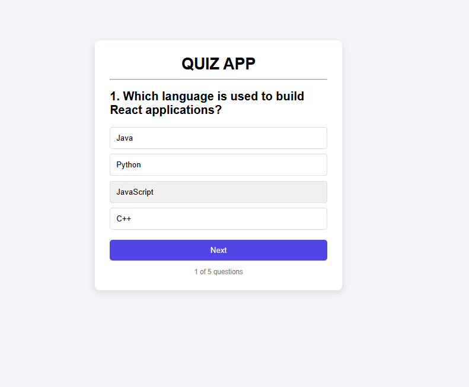

# Quiz Web Application

## 📌 Task Information
**Repository Name:** SCT_WD_3  
**Track:** Web Development Internship  
**Task:** Build a Quiz Web Application

---

## 🚀 Project Description

This project is a **Quiz Web Application built using React**.  
It allows users to answer multiple-choice questions, track their score, and receive results at the end of the quiz.

The application dynamically displays questions, validates user answers, and calculates the final score after completing the quiz.

---

##  Features

*  **Multiple Choice Questions** – Users can select answers from given options  
*  **Next Question Navigation** – Move through quiz questions easily  
*  **Score Calculation** – Displays the final score after quiz completion  
*  **Dynamic Question Rendering** – Questions update without page reload  
*  **User-Friendly Interface** – Clean and responsive UI design  
*  **Restart Quiz Option** – Allows users to retake the quiz

---

##  Technologies Used

* **React.js**
* **JavaScript**
* **CSS**
* **HTML**

---

## ▶️ How to Run the Project

### 1️⃣ Clone the repository

git clone https://github.com/samridhi78B/SC_WD_3.git

### 2️⃣ Navigate to the project folder

cd SCT_WD_3

### 3️⃣ Install dependencies

npm install

### 4️⃣ Run the application

npm start

The app will run at:

http://localhost:3000

---

## 📸 Project Screenshot

---

## 📬 Author

**Samridhi**  
Web Development Intern

---

## 📄 License

This project is created for internship task submission purposes.
